# #CTFFriday 2020JuneWeek3 

* Date: 20th June 2020
* Time: 2:00 to 3:00 PM

## Organized By

   

 <span style="color:red"> Net Square Solutions Pvt. Ltd.</span>                              

## About Me

Hi,

I am [Smit Patel](https://twitter.com/smit_2307) and I am currently working as a Security Analyst at  [Net Square Solutions Pvt. Ltd.](https://net-square.com) I participated in ctf as ```sk```

## Overview

This ```CTF``` is build by [Aman Barot](https://twitter.com/AmanBarot12). There were 3 challenges based on AWS cloud.

<h3>Challenge-1</h3>

**Hints :**
* xploiterds is the part of URL Deep Dive in aws cloud.

**Flag 1 :** 50 Points

**Description :**

* From the given hint i got the idea that it can be s3 bucket name. so i tried to access that s3 bucket URL. so I opened browser and open a following URL. 

 `xploiterds.s3.amazonaws.com`
 
 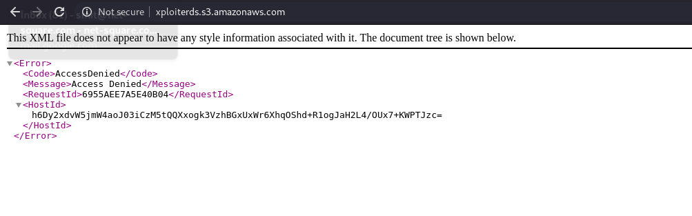 

* I got the error which shows that s3 bucket is not accessible publicly. So I tried with `dirsearch tool` for file enumaration.

 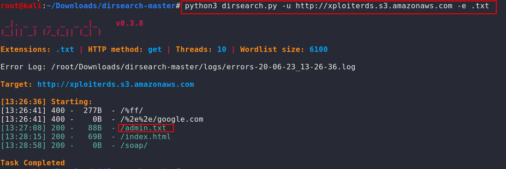

* After enumaration I found `admin.txt` file which contains Aws Access key Id and Aws Secret Access Key.

 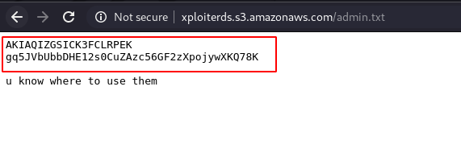

* Configure AWS CLI using those keys.

 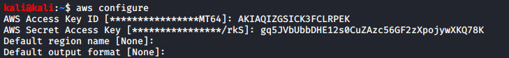

* List all the s3 buckets using `aws s3 ls` command and list all the files from specific buckets using `aws s3 la s3://<Bucket Name>`.

 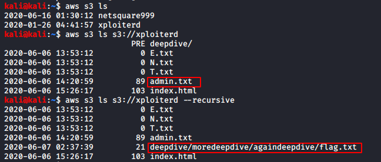

* Copy `flag.txt` from s3 bucket to your directory.

 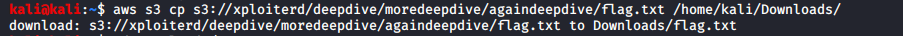

* Observe the flag in `flag.txt` file.

 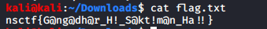

* **`nsctf{G@ng@dh@r_H!_S@kt!m@n_Ha !!}`**

<h3>Challenge-2</h3>

**Hints :**
* Regions are always one major part of AWS.

**Flag 2 :** 100 Points

**Description :**

* List down the instances using `aws ec2 describe-instances --region ap-southeast-1`.

 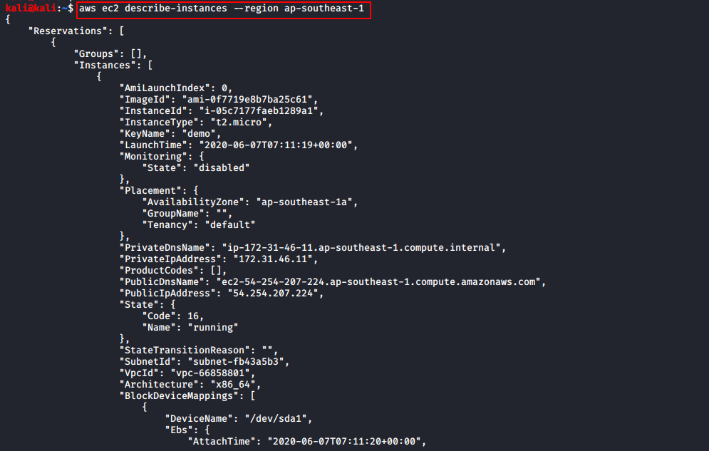

* Observe the public IP and security groups details of instances. 

 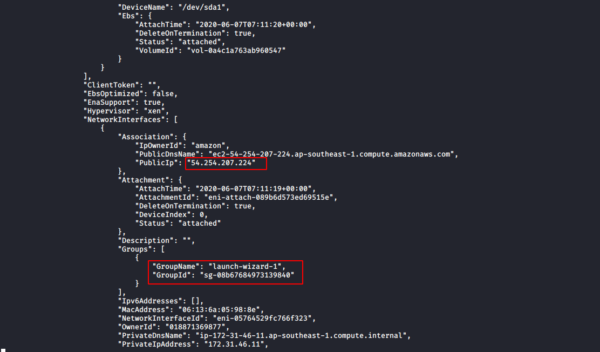

* Check the security configuration of security groups using `aws ec2 describe-security-groups --region ap-southeast-1 --group-names launch-wizard-1`.

 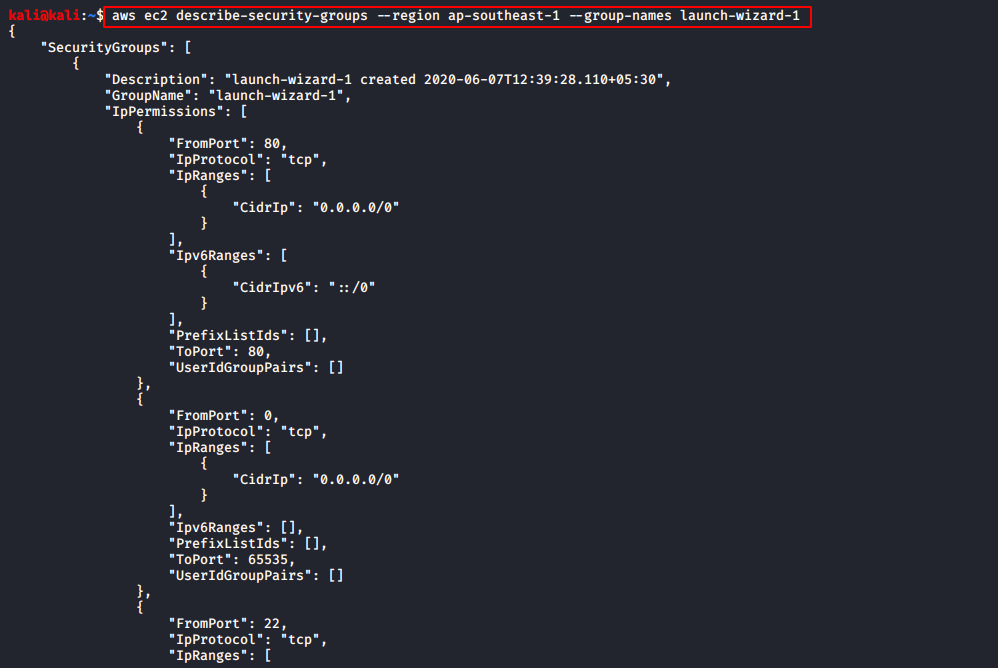

* Observe that port number `33693` is open and website is running on that port.

 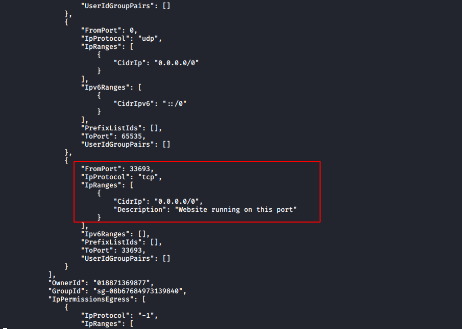

* Try to access the website.

 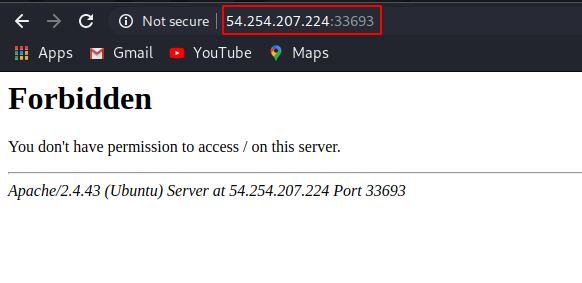

* Observe the source of error page.

 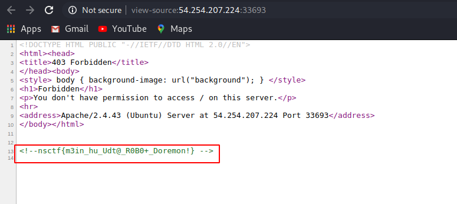

* **`nsctf{m3in_hu_Udt@_R0B0+_Doremon!}`**

<h3>Challenge-3</h3>

**Hints :**
* AWS cloud provide Public IP Address.

**Flag 3 :** 75 Points

**Description :**

* Observe the style tag which says that there is a directory named `background`.

 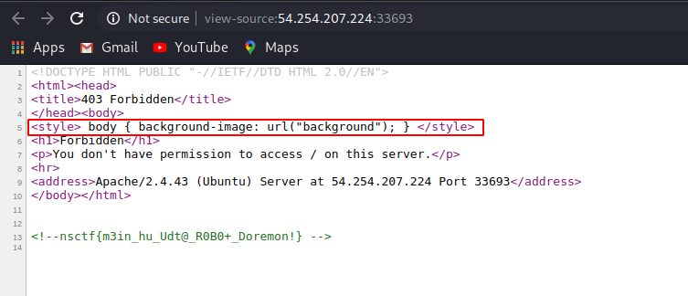

* Try to access `background` directory and observe that there is one file named `file.zip`.

 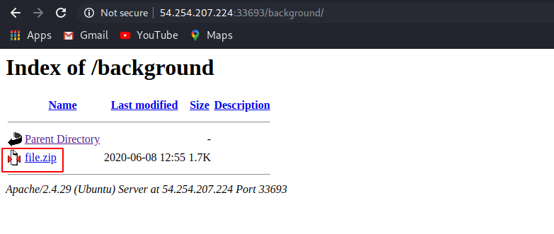

* Try to open that zip file and observe the error.

 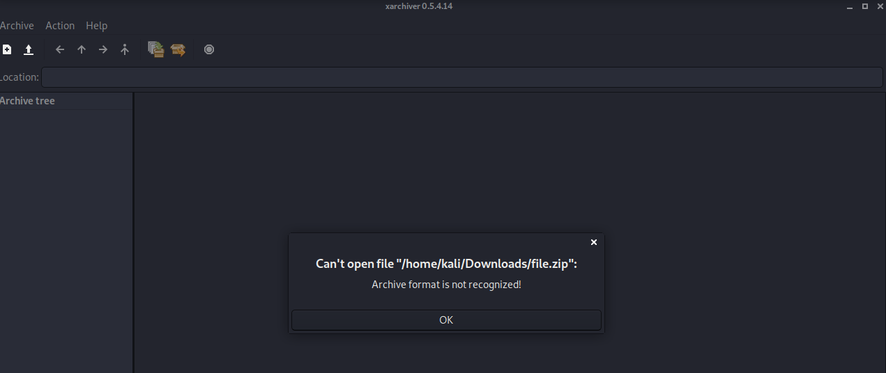

* Check file content using `strings file.zip` command and observe that it's a pem file.

 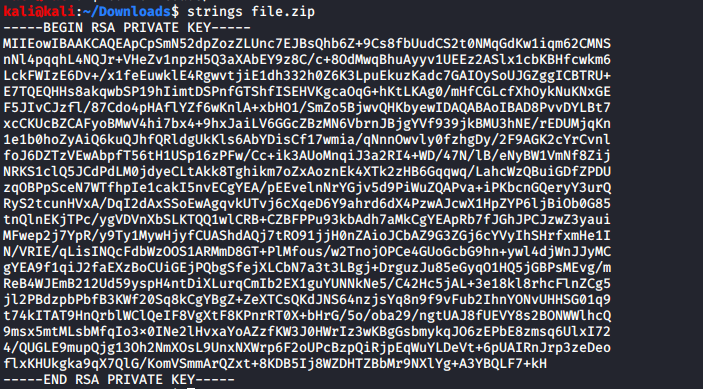

* Rename the file and try to connect to ec2 instance using the pem file.

 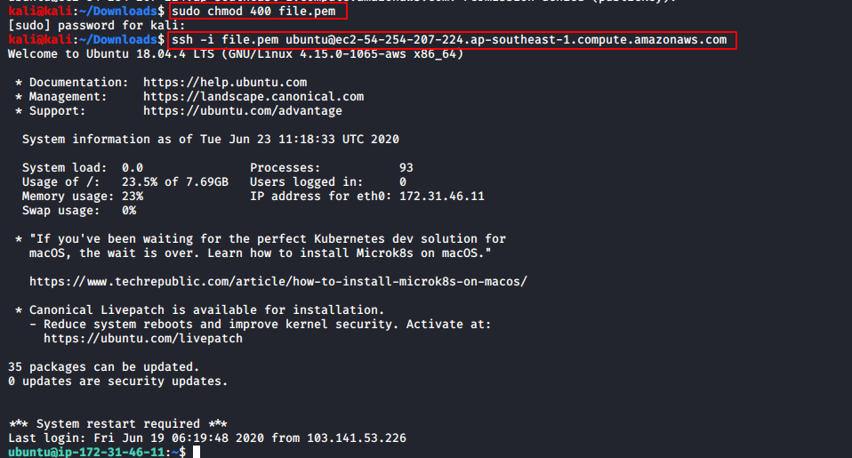

* List down the files and observe that there is one file named `flag.txt`. Open the file and observe the reversed flag.

 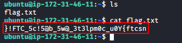

* Use any online tool to reverse the flag.

 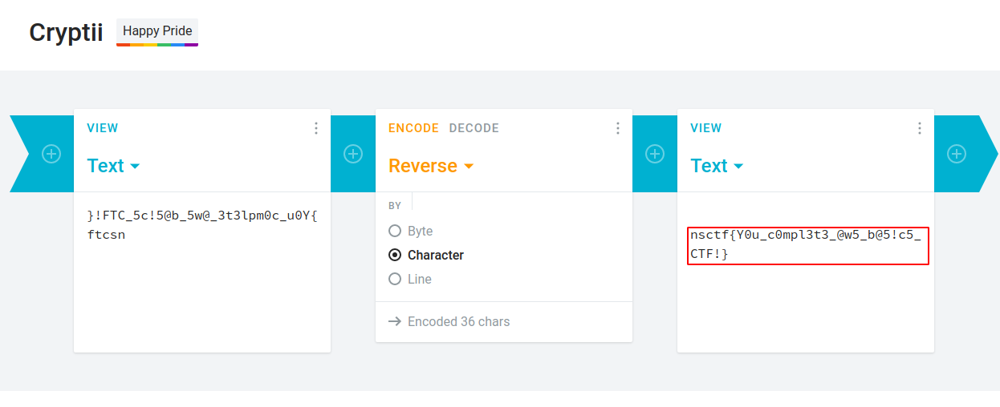

* **`nsctf{Y0u_c0mpl3t3_@w5_b@5ic5_CTF!}`**

-----------------

It was a very nice CTF by [Aman Barot](https://twitter.com/AmanBarot12). We had learnt lots of new things about aws.

Here are the scoreboard of CTF. 

 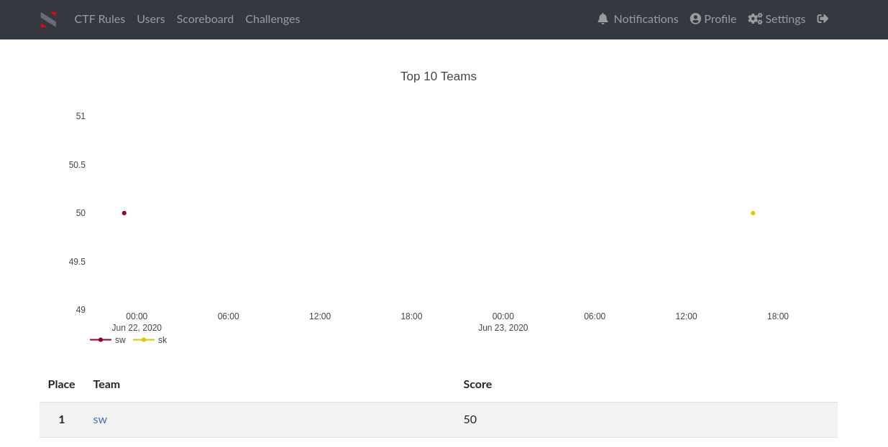